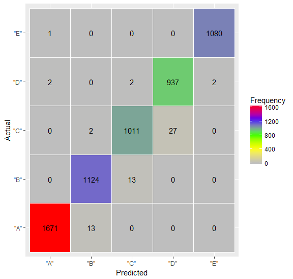

# Classification of Human Activity Recognition data
Ravi Ancil Persad  
January 25, 2017  

## 1. Introduction

In this work, we use the Human Activity Recognition (HAR) dataset available from [here](https://d396qusza40orc.cloudfront.net/predmachlearn/pml-training.csv) (Ugulino et al., 2012). The dataset comprises of ~20,000 sensor measurements collected from 6 human participants who have the devices attached to them whilst performing exercises. There are 160 sensor measurement variables (i.e., the predictors). Additionally, the dataset includes a variable termed _**'classe'**_, which is representative of different ways in which the exercises are performed. This is our response variable which will be used for prediction. It comprises of 5 classes, namely, **A, B, C, D** and **E**.

From the **'pml-training.csv'** file, I split the data into **70% training**  and **30% testing**. The training data will be used for building and cross-validating 3 different classification models:

1) Random Forest with PCA (Principal Component Analysis)
2) Random Forest
3) Gradient Boosting

## 2. Data Preprocessing

Before applying the classification models, we explore the dataset and then perform statistical transformations to faciliate the predictive modeling phase. Firstly, on observing the data we found that a large number of the predictor variables have missing data. Application of imputation is not practical here since most of the data in these columns are non-existent. Figure 1 shows the distribution of **NAs** (missing data) and ***nonNAs** (non-missing data) for all 160 predictor variables.

<div class="figure" style="text-align: center">

<p class="caption">**Figure 1. Composition of missing values in dataset for all 160 predictors.**</p>
</div>

### 2.1. Data Cleaning and Splitting
We keep the columns with a high percentage of nonNAs (>90%) and remain with **59 predictors**. Upon further inspection of the data, the first 6 columns relate to id markers for the human participant from the exercise experiment. They are not useful for building the classifier models and are discarded. 


```r
retained_df = subset(ids_and_percent_2, percent>90) # retain rows where percentage of nonNAs greater than 90% 
retain_ids = as.vector(retained_df$id)
train_clean = train[,retain_ids]
train_clean = train_clean[-c(1:6)] # remove 1st six columns with user id data
```

Some of the sensor measurement features may also have low variability (i.e., comprise of very low amounts of unique values) and thus will not be good predictors. Therefore, we diagnose all the variables and remove those with Zero/Near-Zero variance as follows:


```r
nzv = nearZeroVar(train_clean) # diagnose variables with zero or near-zero variability
filtered_train_clean<- train_clean[, -nzv] # remove Near Zero Variance (nzv) -variables
```

Now, we split our cleaned data into **70% training**  and **30% testing**.


```r
trainIndex <- createDataPartition(filtered_train_clean$classe, p = 0.7, list = FALSE, times = 1)
activ_Train <- filtered_train_clean[ trainIndex,]
activ_Test  <- filtered_train_clean[-trainIndex,]
```


### 2.2. Selection of Optimal Predictor Variables

Finding the most important predictive variables is at the core of building a good predictive model. 
Features that have **high correlation** with other features can cause overfitting and lead to false predictions.
From below, we see there are numerous predictor variables with high correlation (> 0.8) amongst each other.


```r
id_correlated_predictors= findCorrelation(cor(activ_Train[,-52]), cutoff = 0.8, verbose = F)
id_correlated_predictors
```

```
##  [1] 10  1  9 35  8  2 33 20 24 17
```

We want predictors with high variability. PCA can provide us with a set of features that have high variability and low correlation.
**PCA extracts the most important variables** (in form of components) from high dimensional datasets. We also apply a **Box-cox skewness transformation, centering and scaling** of the variables together with the PCA:


```r
preProc <- preProcess(activ_Train[,-52], method=c("BoxCox", "center", "scale", "pca"), thresh = .95)
```

The above code retains the principal components that are necessary to explain at least **95% of the data variability**. Figure 2 shows a Pareto chart where at the 95% explained variance cutoff mark, we obtained **24 principal components** as our most important predictor variables.

<div class="figure" style="text-align: center">

<p class="caption">**Figure 2. Application of PCA for uncorrelated variable selection.**</p>
</div>

## 3. Classifier Training and Parameter Tuning

We train 3 classification models: 
i) Random Forest with the PCA predictors, 
ii) Random Forest with skew-corrected, centered and scaled predictors (no PCA applied) and 
iii) Gradient Boosting with skew-corrected, centered and scaled predictors (no PCA applied). 

We also take advantage of Caret's parallel processing capabilities and apply multicore- training. Below is the sample code for training the first model (RF w/ PCA). A 5-fold cross-validation is also applied to select the best model from the training data.


```r
# --------- set up for parallel processing while training predictive model ---------#
library(doParallel)
library(parallel)

cl <- makeCluster(detectCores() - 4) # leave 4 core for OS & use 4 for training
registerDoParallel(cl)

#----------  Model Training and Parameter Tuning --------#

trainPC = predict(preProc,activ_Train) # create training dataframe for the 24 Principal Components 
trainPC = movetolast(trainPC, c("classe")) # set the 'classe' variable as the last column

fitControl <- trainControl(method = "cv",
                           number = 5,
                           allowParallel = TRUE) # Cross-Validation setting here (we use 5-fold CV)


rf_model1 <- train(classe ~ ., data = trainPC, 
                   method = "rf", 
                   trControl = fitControl)

stopCluster(cl) # stopping parallel processing
registerDoSEQ() # registerDoSEQ() makes R to return to single threaded processing
```

## 4. Classifier testing 

Using the testing data (5885 row entries) unseen by the classifiers (obtained from the 30% split explained above), we generate predictions for the 'classe' response variable and compute an out of sample prediction error for each of the 3 models.The out of sample error simply measures the percentage of predicted responses which match the actual 'ground truth' responses. The following is the sample code for classifier model 1 (RF w/ PCA)


```r
# ---------- Apply model to my Test data -----------#
testPC = predict(preProc,activ_Test[,-52]) # testing dataframe for the 24 Principal Components 

# ---------- Out of Sample Error ---------------#
result1 = confusionMatrix(activ_Test$classe, predict(rf_model1, testPC))
```

Figure 3 shows the respective **out of sample errors** for the 3 classifiers. Random Forest (with skew-corrected, scaled and centered predictors) achieves the highest accuracy **98.93%** , closely followed by Random Forest with PCA-based predictors at **97.23%** and then Gradient Boosting at **95.87%**. Figure 4 illustrates the confusion matrix for our best model.


<div class="figure" style="text-align: center">

<p class="caption">**Figure 3. Out-of-Sample Accuracies for the 3 classification models.**</p>
</div>

  
  
  

<div class="figure" style="text-align: center">

<p class="caption">**Figure 4. Confusion matrix for optimal model (Random Forest at 98.93%).**</p>
</div>


## 5. Conclusion
We presented a machine learning framework to classifiy human activity measurements obtained from various sensors such as accelerometers,etc. Three different classification models were developed. We firsly built a Random Forest model which used PCA-based predictors. PCA predictors were generated due to high correlation among several of the original, raw feature variables. However, our 2nd model, the Random Forest classifier without any PCA being applied surprisingly provided the **highest out-of-sample error at 98.93%**, albeit with only a marginal increase of 1.7%  compared to the PCA model.

## References

1. Ugulino, W.; Cardador, D.; Vega, K.; Velloso, E.; Milidiu, R.; Fuks, H. Wearable Computing: Accelerometers' Data Classification of Body Postures and Movements. Proceedings of 21st Brazilian Symposium on Artificial Intelligence. Advances in Artificial Intelligence - SBIA 2012. In: Lecture Notes in Computer Science. , pp. 52-61. Curitiba, PR: Springer Berlin / Heidelberg, 2012.
